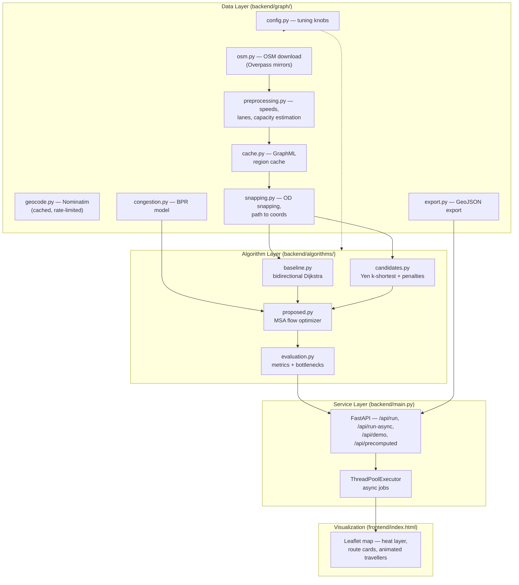
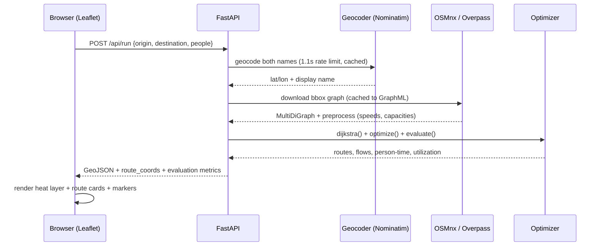
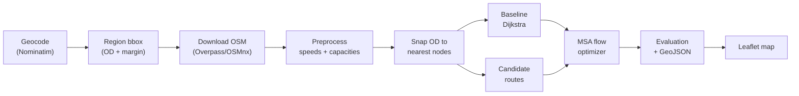
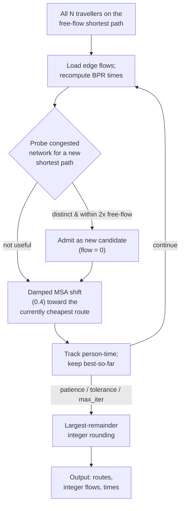

# BetterGoogleMaps — Collective Traffic Routing on Real Road Networks

*Running on the FlowTwin engine** · FastAPI + OSMnx + NetworkX + Leaflet


## Abstract

Conventional navigation systems answer a *single-traveller* question: *what is
the fastest route for one vehicle?* When thousands of travellers request the
same origin–destination (OD) pair simultaneously, each receiving the identical
"fastest" route, they collectively concentrate on one corridor and create the
very congestion they were routed around. **BetterGoogleMaps** reframes this as
a *system-optimal* problem: given an OD pair and a demand of *N* travellers,
find the **route-flow allocation that minimizes network-wide person-hours**.

We implement this end-to-end on **real OpenStreetMap road networks**: the
region graph is downloaded via OSMnx, speeds/capacities are estimated per
highway class, congestion is modelled with the nonlinear **BPR** function, and
an **MSA-style damped flow-assignment optimizer** distributes travellers across
dynamically discovered candidate routes. On real Chennai OD presets with
N = 2000 travellers, the collective allocation reduces total person-time by
**6.6%–45.1% (mean ≈ 21%)** relative to everyone-following-the-shortest-path.

Every reported number derives from actual execution. Capacities and speeds are
estimated (and flagged as such); demand is simulated, not live traffic.

**Keywords** — collective routing, traffic assignment, system optimum, BPR
function, Method of Successive Averages, k-shortest paths, OpenStreetMap,
OSMnx, FastAPI, Leaflet

---

## 1. Introduction

### 1.1 Motivation

| | Classical navigation | BetterGoogleMaps |
|---|---|---|
| Question | *Fastest route for one traveller?* | *Which allocation minimizes network-wide travel time?* |
| Objective | Min one vehicle's time | Min Σₑ xₑ · tₑ(xₑ) (person-time) |
| Output | One path | A set of routes + integer flow split |
| Congestion | Avoided per-vehicle | Modelled and *managed* collectively |

The single-route policy is individually optimal but collectively poor: with
high demand concentrated on one corridor, congestion delays every follower.
Spreading demand over a small portfolio of alternative routes exploits the
network's spare capacity.

### 1.2 Contributions

1. **A complete, reproducible pipeline** from a free geocoder (Nominatim) and
   OpenStreetMap to an interactive map — no API keys anywhere.
2. **Own implementations** of bidirectional Dijkstra, Yen k-shortest paths with
   penalty-based corridor generation, and a damped MSA flow optimizer with
   dynamic candidate discovery.
3. **Execution-derived evaluation**: baseline vs. collective comparison with
   person-time, per-route congestion times, edge utilization, bottlenecks.
4. **A visualization layer** that colours every road by its flow/capacity
   ratio (a traffic heat layer computed from the assignment itself).

---

## 2. Problem Formulation

Given a directed road graph `G = (V, E)` where each edge *e* carries a
free-flow travel time `t₀ₑ` and a capacity `cₑ`, a demand of *N* travellers
from source *s* to target *t*, and a candidate path set `P₁ … P_k`:

**minimize** the network-wide person-time

```
      Z(f) = Σₑ xₑ · tₑ(xₑ)          (shared edges counted once)
```

**subject to**

```
      Σᵢ fᵢ = N,   fᵢ ≥ 0            (demand conservation)
      xₑ = Σᵢ fᵢ · 𝟙[e ∈ Pᵢ]         (edge flows implied by route flows)
```

where edge travel time follows the **BPR (Bureau of Public Roads)** function:

```
      tₑ(xₑ) = t₀ₑ · (1 + α · (xₑ / cₑ)^β)        α = 0.15, β = 4
```

with a defensive cap `tₑ ≤ 3 · t₀ₑ` and a capacity floor of 100 veh/h.
This is a nonlinear assignment problem; we solve it heuristically with a damped
Method of Successive Averages (§4.3).

---

## 3. System Architecture

The system is a three-layer stack. The algorithm core is deliberately
decoupled from HTTP/UI so it can be scripted in experiments.



### 3.1 Request lifecycle



---

## 4. Methodology

### 4.1 Pipeline overview



### 4.2 Graph construction and preprocessing

The region is the bbox of the OD pair, padded by a fraction of the OD distance
(clamped to `[0.001°, 0.008°]`) so we never download an entire city; graphs are
trimmed to the largest connected component and hard-capped at 8000 nodes.
Edges shorter than 1 m are treated as artifacts and dropped.

| Attribute | Source | Notes |
|---|---|---|
| `length_m` | OSM geometry | Real edge length |
| `speed_kph` | OSM `maxspeed`, else class table | Missing values flagged `speed_estimated` |
| `free_time_s` | `length_m / speed` | Edge weight used by all searches |
| `lanes` | OSM `lanes` tag, else class default | |
| `capacity_vph` | `lanes × class capacity` (ESTIMATED) | Defensive floor 100 veh/h |

| Highway class | Speed (km/h) | Capacity (veh/h/lane) |
|---|---|---|
| motorway | 90 | 2200 |
| trunk | 70 | 1900 |
| primary | 55 | 1700 |
| secondary | 45 | 1500 |
| tertiary | 35 | 1200 |
| residential | 25 | 900 |
| service / living_street | 15 | 600 / 500 |
| unclassified | 30 | 900 |

### 4.3 The collective optimizer (`proposed.py`)

The optimizer is a damped Method of Successive Averages with *dynamic
candidate discovery* — candidate routes are not fixed in advance but grown as
congestion reveals useful detours:



Key design decisions:

- **Damping (0.4)** prevents oscillation between two attractive routes; only
  40% of demand moves toward the cheapest route per iteration.
- **Best-so-far tracking** with a patience counter (4 non-improving
  iterations) guards against MSA oscillation.
- **Dynamic discovery** differs from a static Yen k-shortest: each iteration
  temporarily raises `free_time_s` by the BPR factor, probes for a shortest
  path on the *congested* network, and admits it only if its free-flow time is
  ≤ (1 + 2.0)× the shortest path and it differs from accepted routes by ≥ 30%
  of edges (`MIN_ROUTE_EDGE_OVERLAP = 0.70`).
- **Exact integer split**: largest-remainder rounding guarantees
  `Σ flows = N` with no fractional travellers.

## 5. Algorithm Components

### 5.1 Baseline — bidirectional Dijkstra (`baseline.py`)

An own implementation with alternating forward/backward frontiers and a
meeting-point check (OSRM/cppRouting-style). Explores roughly half the nodes
of a unidirectional search on road networks. The baseline policy is simply
*all N travellers on the free-flow shortest path*.

### 5.2 Candidate generation (`candidates.py`)

Yen k-shortest paths (own implementation, spur cap 40) plus penalty rounds
(factor 1.5, 3 rounds) that inflate already-used corridors to force spatial
diversity. Candidates are filtered by:

| Filter | Value | Purpose |
|---|---|---|
| Free-flow time threshold | ≤ 2.0× shortest | No absurd detours |
| Max candidates | 6 | Bounded optimizer cost |
| Min edge overlap | 0.70 | Reject near-duplicate routes |

### 5.3 Complexity

| Component | Time | Space |
|-----------|------|-------|
| Bidirectional Dijkstra | O(E log V) | O(V) |
| Yen k-shortest | O(k·S·(E log V)), S = spur cap | O(k·V) |
| MSA optimizer / iteration | O(k·(E log V)) | O(E) |
| Full run (typical) | O((k + I)·E log V), I ≤ 30 iterations | O(E + k·L) |

### 5.4 Visualization enhancements

- **Traffic heat layer** — every road coloured by flow/capacity from the
  actual assignment (blue = free … red = over capacity).
- **Animated travellers** — "Play simulation" animates dots along each
  collective route, scaled to the number of people assigned.
- **Route cards** — click to highlight a corridor and dim the others.
- **Precomputed presets** — popular Chennai OD pairs served instantly from
  cached results, no OSM download on click.

## 6. Experimental Results

All runs use the real Chennai OSM road network, N = 2000 travellers,
BPR α = 0.15 / β = 4, optimizer damping 0.4, max 30 iterations. Numbers are
from the saved execution results in `results/precomputed/` (no simulation of
convenience — every value is computed from the executed graph and algorithm).

### 6.1 Collective vs. baseline (N = 2000)

| OD preset | Graph (n / m) | Base km | Base time (min) | Coll. avg (min) | Person-time saved | Improvement |
|---|---|---|---|---|---|---|
| Airport → Central | 5,317 / 12,917 | 16.7 | 32.91 | 26.83 | 202.5 h | **18.5%** |
| Airport → Guindy | 3,330 / 8,160 | 7.7 | 16.26 | 11.78 | 149.3 h | **27.6%** |
| Airport → T. Nagar | 4,878 / 12,068 | 10.6 | 18.14 | 15.26 | 96.0 h | **15.9%** |
| Airport → VIT | 4,916 / 11,814 | 12.0 | 65.52 | 35.98 | 984.8 h | **45.1%** |
| Central → Airport | 5,317 / 12,917 | 19.4 | 36.12 | 30.07 | 201.9 h | **16.8%** |
| Central → Guindy | 7,888 / 19,174 | 13.9 | 22.73 | 18.88 | 128.4 h | **16.9%** |
| Central → T. Nagar | 7,521 / 18,288 | 9.0 | 16.25 | 12.54 | 123.6 h | **22.8%** |
| Central → VIT | 16,527 / 39,979 | 36.3 | 59.24 | 55.34 | 129.7 h | **6.6%** |
| Guindy → Airport | 3,330 / 8,160 | 6.2 | 16.54 | 11.62 | 164.1 h | **29.8%** |
| Guindy → Central | 7,888 / 19,174 | 12.3 | 21.68 | 17.06 | 154.1 h | **21.3%** |
| Guindy → T. Nagar | 4,056 / 10,023 | 4.7 | 8.73 | 7.74 | 32.8 h | **11.3%** |

**Mean improvement ≈ 21%** in network-wide person-time. Typical runs use
2–3 routes and converge within 6–10 iterations (reason: `no_improvement`).

### 6.2 Discussion

- **Gains scale with spare network capacity.** Airport → VIT (45.1%) and
  Guindy → Airport (29.8%) have many viable parallel corridors; the optimizer
  splits demand and keeps every edge below its BPR "knee".
- **Long single-corridor trips gain least.** Central → VIT (6.6%) spans 36 km
  where alternatives are sparse relative to the dominant highway corridor.
- **Baseline congestion is severe.** With 2000 travellers on one path, the
  baseline congested time exceeds free-flow time by 54–165% across presets —
  the collective policy keeps average traveller time close to free-flow.

### 6.3 Threats to validity

| Threat | Mitigation |
|---|---|
| Estimated capacities (no live traffic) | All estimated fields flagged `*_estimated`; BPR params are literature defaults |
| Simulated demand (uniform N on one OD) | Explicitly labelled; no fabricated metrics |
| Heuristic optimizer (not exact system optimum) | Best-so-far + convergence reporting per run |
| Candidate pool bounded (≤ 6, ≤ 2× free-flow) | Conservative by design; avoids unrealistic detours |

---

## 7. How to Run

### 7.1 Prerequisites

- Python ≥ 3.10
- No API keys required (OpenStreetMap + Nominatim are free)

### 7.2 Installation

```bash
git clone https://github.com/Darshcmd/BetterGoogleMaps.git
cd BetterGoogleMaps

# 1. Create a virtual environment
python3 -m venv backend/.venv

# 2. Install dependencies
backend/.venv/bin/pip install -r backend/requirements.txt

# 3. (Optional) configure environment
cp .env.example .env   # then edit .env if needed
```

### 7.3 Start the backend

```bash
cd backend
.venv/bin/python -m uvicorn main:app --port 8000 --app-dir .
# or from the repo root:
backend/.venv/bin/python -m uvicorn main:app --port 8000
```

### 7.4 Open the frontend

```bash
open frontend/index.html        # macOS
xdg-open frontend/index.html    # Linux
```

> If the browser blocks the API call from a `file://` page, serve the frontend:
> `python3 -m http.server 8080 --directory frontend` → http://localhost:8080

### 7.5 Using the UI

| Button | What it does |
|---|---|
| **Run preset (instant)** | Loads a precomputed Chennai result — map renders immediately |
| **Run demo** | Runs the synthetic demo graph (no OSM download) |
| **Run custom** | Geocodes your origin/destination, downloads the OSM region, runs the full pipeline |

### 7.6 Batch experiments

```bash
cd backend && .venv/bin/python experiments/run_experiment.py
backend/.venv/bin/python scripts/precompute.py   # rebuild precomputed presets
```

### 7.7 Tests

```bash
cd backend && .venv/bin/python -m pytest tests/ -v
```

---

## 8. API Reference

| Endpoint | Method | Description |
|---|---|---|
| `/health` | GET | Liveness check |
| `/api/geocode` | POST | Nominatim search (cached, rate-limited) |
| `/api/run` | POST | Synchronous run (small graphs, < 30 s) |
| `/api/run-async` | POST | Start async job → `{job_id}` |
| `/api/job/{jid}` | GET | Poll job status/progress |
| `/api/demo` | POST | Run on the synthetic demo graph (instant) |
| `/api/precomputed` | GET | List precomputed preset results |
| `/api/precomputed/{key}` | GET | Fetch one precomputed result |
| `/api/results/{rid}` | GET | Fetch any saved experiment result |

Example:

```bash
curl -s -X POST http://localhost:8000/api/run \
  -H 'Content-Type: application/json' \
  -d '{"origin": {"name": "Chennai Central"},
       "destination": {"name": "VIT Chennai"},
       "people": 2000}' | python3 -m json.tool | head -40
```

---

## 9. Configuration

All tuning knobs live in `backend/graph/config.py` and can be overridden via
environment variables (copy `.env.example` to `.env`):

| Variable | Default | Purpose |
|---|---|---|
| `FLOWTWIN_DATA_DIR` | `data/` | GraphML cache + geocode cache location |
| `FLOWTWIN_OVERPASS_URL` | 4 public mirrors | Comma-separated Overpass endpoints (probed in order) |
| `FLOWTWIN_OSMNX_TIMEOUT` | `240` | OSM download timeout (s) |
| `FLOWTWIN_OSMNX_MEMORY` | `3000` | Overpass memory budget (MB) |
| `FLOWTWIN_BPR_ALPHA` | `0.15` | BPR congestion α |
| `FLOWTWIN_BPR_BETA` | `4.0` | BPR congestion β |

Fixed in-code knobs: candidate threshold 2.0×, max candidates 6, penalty
factor 1.5 / 3 rounds, overlap 0.70, damping 0.4, max 30 iterations,
patience 4, tolerance 1e-4.

---

## 10. Limitations & Future Work

**Limitations**

- Capacities/speeds are estimated per highway class (flagged `*_estimated`)
- Demand is simulated, not derived from live traffic feeds
- Alternatives constrained to ≤ 2.0× free-flow time, ≤ 6 routes
- BPR parameters are literature defaults, not calibrated locally

**Future work**

- Live traffic calibration of `t₀ₑ` and `cₑ` from probe data
- Game-theoretic comparison: system optimum vs. Wardrop user equilibrium (price of anarchy)
- Multi-OD demand matrices and capacity-constrained flow formulations
- frank-wolfe / column-generation baselines for optimality gaps
- Turn restrictions, traffic signals, and time-dependent travel times

---

## References

1. U.S. Bureau of Public Roads — *Traffic Assignment Manual* (BPR function, 1964)
2. Sheffi, Y. — *Urban Transportation Networks* (MSA / traffic assignment, 1985)
3. Yen, J.Y. — *Finding the K Shortest Loopless Paths in a Network*, Management Science (1971)
4. Boeing, G. — *OSMnx: New Methods for Acquiring, Constructing, and Analyzing Road Networks*, arXiv:1611.01890
5. OpenStreetMap (ODbL) · Nominatim · Leaflet · FastAPI · NetworkX

## Attribution

Map data © OpenStreetMap contributors (ODbL). Geocoding by Nominatim.
Built with FastAPI, OSMnx, NetworkX, Shapely, Leaflet. Independent
implementation inspired by the GiggleMaps collective-routing concept.

